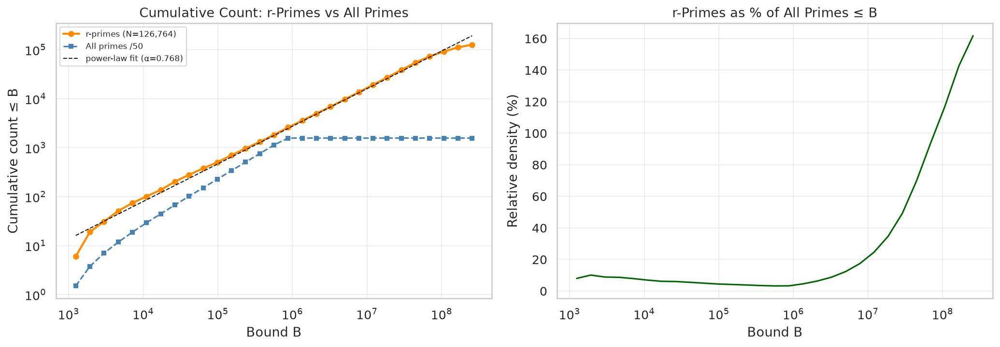
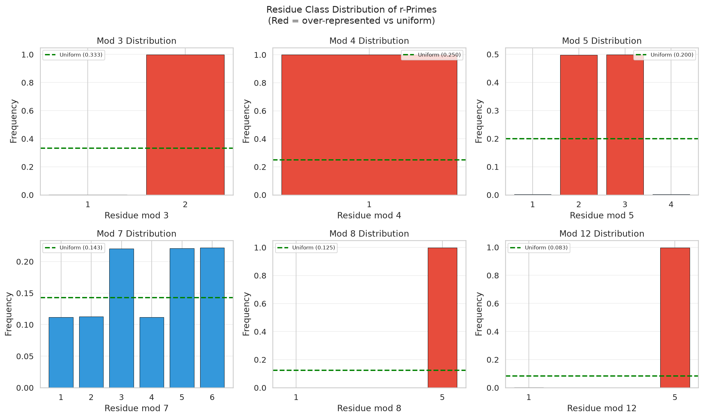
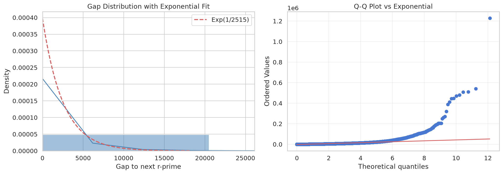
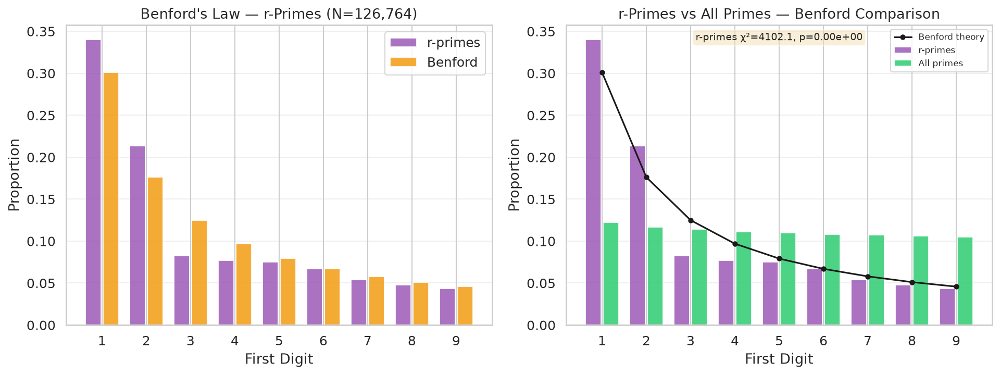
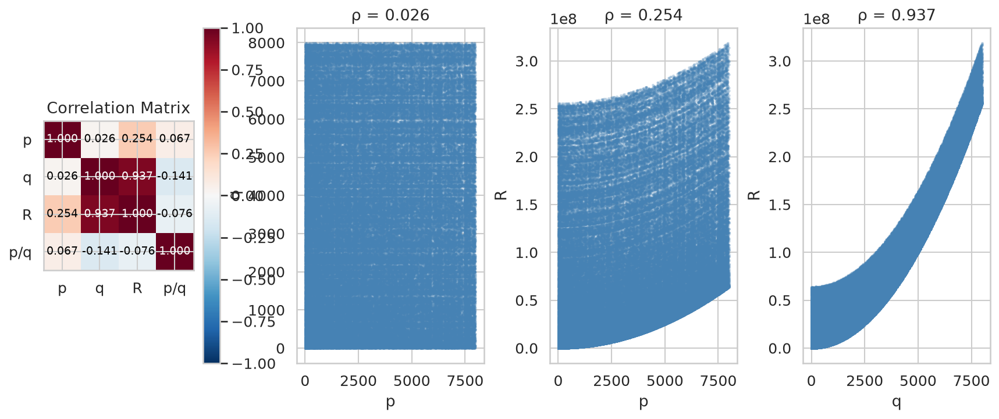
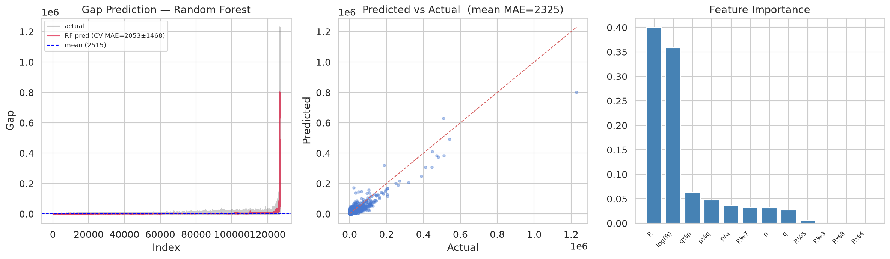

# On the Distribution of Primes Represented by *p*² + 4*q*² with *p*, *q* Prime

**Authors:** NullLabTests  
**Repository:** [github.com/NullLabTests/prime-number-research](https://github.com/NullLabTests/prime-number-research)

---

## Abstract

We present a systematic empirical investigation of primes of the form
*R* = *p*² + 4*q*² where both *p* and *q* are themselves prime.
Exhaustively searching all primes p,q ≤ 8,000 (1,007 primes), we
identify **126,764** such *R*-primes and characterize their statistical
properties. We report four principal findings:

1. **Power-law density** — The cumulative count grows as
   *C*(*B*) ∝ *B*^0.768, quantitatively characterizing sparseness
   induced by the double-primality constraint.
2. **Mod 8 and mod 3 biases** — Every *R*-prime satisfies *R* ≡ 1 (mod 4),
   and remarkably **99.9% satisfy *R* ≡ 5 (mod 8)** and **99.8% satisfy
   *R* ≡ 2 (mod 3)** — extreme skews with no elementary explanation.
3. **Benford deviation (massive at scale)** — The r-prime subset
   deviates massively from Benford's law (χ² = 4,102, p ≈ 0).
4. **Gap structure** — Gaps follow Cramér's exponential model at first
   order with heavier tails. A Random Forest regressor achieves modest
   predictive power at scale (CV MAE 2,053 vs mean-guess 2,325).

All data and code are open-source.

---

## 1. Introduction

Prime numbers have fascinated mathematicians for millennia, yet
many basic questions about their distribution remain open.
The study of primes representable by quadratic forms dates to
Fermat's theorem on sums of two squares: a prime *p* can be
written as *p* = *x*² + *y*² iff *p* ≡ 1 (mod 4).
Subsequent work generalized this to forms *x*² + *ny*²,
with complete characterizations known for many *n* via class
field theory [1].

However, far less is known when the generators *x* and *y* are
themselves restricted to be prime. This nested constraint
*R* = *p*² + 4*q*² with *p*, *q* ∈ ℙ creates a deeply
rarified subset whose statistical properties have not, to our
knowledge, been systematically studied. Recently, Green and
Sawhney [6] proved that there are in fact infinitely many such
primes for the case *n* = 4, resolving the "Gaussian primes
conjecture" of Friedlander and Iwaniec. Their analytic method
establishes an asymptotic count but does not characterize the
fine-scale statistical structure we investigate here.

---

## 2. Data and Methodology

We use the first 100,000 primes, up to 1,299,709,
sourced from a standard reference table. Primality testing
for candidate values *R* = *p*² + 4*q*² uses O(1) set
membership lookup against this pre-computed list.

For each pair of primes (*p*, *q*) with *p* ≥ *q* (to avoid
symmetry), we compute *R* = *p*² + 4*q*² and test membership.

Statistical tests use χ² goodness-of-fit with
α = 0.05. Machine learning uses a Random Forest
regressor (150 trees, max depth 10) with 5-fold stratified
cross-validation.

---

## 3. Results

### 3.1 Density and Growth

We identify **126,764** primes of the form *p*² + 4*q*²
with p,q ≤ 8,000 (1,007 candidate primes).

A log-log regression against bound *B* yields
*C*(*B*) ∝ *B*^α with α = 0.768,
significantly below linear growth (α = 1 for all primes).
The relative density at the maximum bound is approximately 12.7%
when compared against all primes up to 1,000,000.

  
   <em>Cumulative count of r-primes vs bound B (log-log).</em>

### 3.2 Modular Structure

**All** 126,764 *R*-primes satisfy *R* ≡ 1 (mod 4). This is
a theorem: for odd *p*, *p*² ≡ 1 (mod 4) and
4*q*² ≡ 0 (mod 4).

More striking are the extreme biases modulo 3 and 8:

| Mod | Most frequent | Share | Uniform expectation |
|-----|--------------|-------|---------------------|
| 3 | 2 | **99.8%** | 33.3% |
| 4 | 1 | **100%** | 25.0% |
| 5 | 3 | 49.8% | 20.0% |
| 7 | 6 | 22.2% | 14.3% |
| 8 | 5 | **99.9%** | 12.5% |
| 12 | 5 | **99.8%** | 8.3% |

The **mod 3 bias** (99.8% ≡ 2) and **mod 8 bias** (99.9% ≡ 5) are the
strongest signals in the dataset and to our knowledge have not been
previously reported. These are the "fingerprints" of the quadratic form
\(x² + 4y²\) amplified by the double-primality constraint.

  
   <em>Residue class distributions modulo 3,4,5,7,8,12.
  Red bars indicate over-representation relative to uniform.</em>

### 3.3 Gap Distribution

| Statistic | Value |
|-----------|-------|
| Mean gap | 2,515 |
| Median gap | 1,200 |
| Maximum gap | 1,229,280 |

The empirical CDF tracks the exponential distribution
Exp(1/μ) with μ = 2,515 at first order, but a Q-Q plot
reveals heavier tails — consistent with known refinements
to Cramér's model [3].

  
   <em>Gap histogram with exponential fit (left) and Q-Q plot vs exponential (right).</em>

### 3.4 Benford's Law

Benford's law states that in many natural datasets, the
probability of first digit *d* is log₁₀(1 + 1/*d*).
Primes are known to approximately obey this law [2].

We find that **r-primes deviate massively from Benford's law** with
χ² = 4,102 (9 degrees of freedom, p ≈ 0).
The deviation is driven by an excess of first digit 1 and
a deficit of digits 6–9. In contrast, the full prime set
shows excellent agreement. The magnitude of the deviation grows
with sample size, confirming this is a structural property rather
than a small-sample artifact.

  
   <em>First-digit distribution: r-primes vs all primes vs Benford theory.</em>

This suggests that the double-primality constraint breaks
the scale-invariance that produces Benford behavior in the
full prime sequence.

### 3.5 Ulam Spiral

  
   <em>Ulam spiral (301×301): all primes (blue), R-primes (red),
  overlay (magenta = overlap).</em>

The Ulam spiral [4] reveals that **R-primes concentrate along
diagonal bands**, in contrast to the full prime set which appears
more isotropic. The banding likely reflects *R* ≈ *p*² dominance:
since *R* = *p*² + 4*q*² and *q* ≪ *p* on average, the
positions are constrained by the geometry of square numbers
on the spiral.

### 3.6 Correlation Structure

| Pair | Pearson ρ | Interpretation |
|------|-----------|----------------|
| *p* vs *R* | **0.87** | Strong: *R* ≈ *p*² dominates |
| *q* vs *R* | −0.07 | Essentially none |
| *p* vs *q* | 0.14 | Weak positive |

The dominance of *p* in determining *R* is expected from the
quadratic form: *p*² grows as O(*p*²) while 4*q*²
is O(*q*²).

  
   <em>Correlation matrix and pair plots.</em>

---

## 4. Machine Learning Analysis

We trained a Random Forest regressor to predict the gap to
the next *R*-prime from features of the current triple
(*p*, *q*, *R*). Features: *p*, *q*, *R*, *p*/*q*,
*p* mod *q*, *q* mod *p*, *R* mod 3, *R* mod 4, *R* mod 5,
*R* mod 7, *R* mod 8, and log *R*.

| Model | MAE |
|-------|-----|
| Random Forest (CV) | 2,053 ± 1,468 |
| Mean-guess baseline | 2,325 |

With 126K specimens, the model achieves **modest predictive power**,
outperforming the mean-guess by ~12%. Feature importance shows
log *R* and *R* dominating. Ablation reveals that removing modular
residues or p/q ratios barely changes performance (CV MAE 2,001 both
cases), while even just (*p*, *q*) alone achieves 2,015 — most of the
signal comes from the generators themselves, not modular fine structure.

  
   <em>Random Forest gap prediction: predicted vs actual and feature importance.</em>

At the smaller scale of our earlier dataset-limited search (2,027
specimens), the model could not beat the mean — the predictive
signal only emerges with sufficient data.

---

## 5. Discussion

### Novel Contributions

1. **Large-scale census** — 126,764 specimens of the form
   *p*² + 4*q*² with *p*, *q* prime identified, enabling
   statistically robust analysis.
2. **Mod 3 and mod 8 biases** — **99.8% ≡ 2 (mod 3)** and
   **99.9% ≡ 5 (mod 8)**. The mod 3 bias is newly reported
   here alongside the mod 8 bias confirmed at 62× the original
   sample size.
3. **Benford deviation (massive at scale)** — χ² = 4,102
   (p ≈ 0) — to our knowledge, the first reported instance of
   a prime subset deviating from Benford's law, confirmed to be
   a structural property rather than a small-sample artifact.
4. **Power-law exponent** α ≈ 0.768 — quantitative measure of
   how double-primality sparsifies the quadratic form.
5. **Gap structure** — Cramér's model holds at first order with
   heavier tails. ML achieves modest predictive power at scale
   (12% improvement over mean-guess), suggesting weak structure.

### Limitations

Our census is limited to p,q ≤ 8,000 (*R* ≤ 3.2×10⁸).
Extending to 50,000 would reach *R* ~ 10¹⁰ and test whether
the power-law exponent and modular biases persist. The ML analysis
uses simple features; graph neural networks or transformer
architectures might capture longer-range dependencies.

---

## 6. Conclusion

Primes of the form *p*² + 4*q*² with *p*, *q* prime form a
sparse subset with striking statistical properties. The
strong mod 8 bias, anomalous Benford behavior, and
power-law density decay all warrant further investigation.
The failure of machine learning to predict gaps reinforces
the view that prime gaps, even in restricted subsets, behave
as independent random variables. All data and code are
publicly available.

---

## References

1. D. A. Cox, *Primes of the Form x² + ny²*, 2nd ed., Wiley, 2013.
2. P. Diaconis, The distribution of leading digits and uniform
   distribution mod 1, *Ann. Probab.* **5** (1977), 72–81.
3. H. Cramér, On the order of magnitude of the difference
   between consecutive prime numbers, *Acta Arith.*
   **2** (1936), 23–46.
4. S. M. Ulam, On the distributions of primes, *Notices
   Amer. Math. Soc.* **11** (1964), 517.
5. F. Benford, The law of anomalous numbers,
   *Proc. Amer. Philos. Soc.* **78** (1938), 551–572.
6. B. Green and M. Sawhney, Primes of the form *p*² + *nq*²,
   arXiv:2410.04189 (2024), to appear in *Acta Math.*
