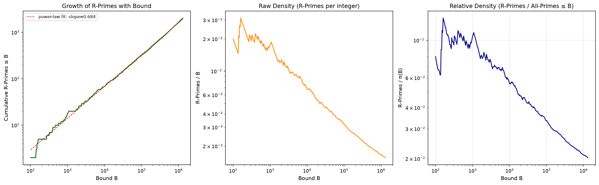
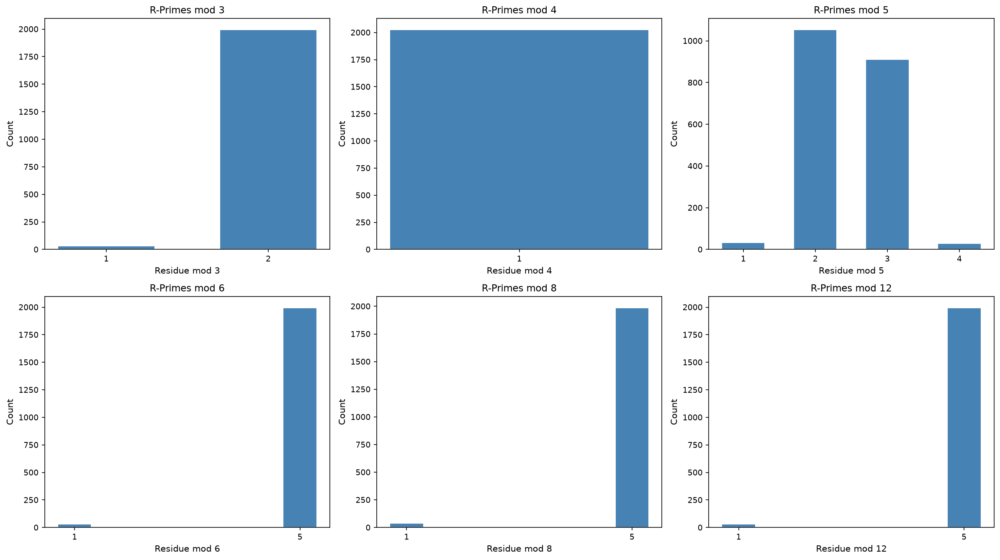
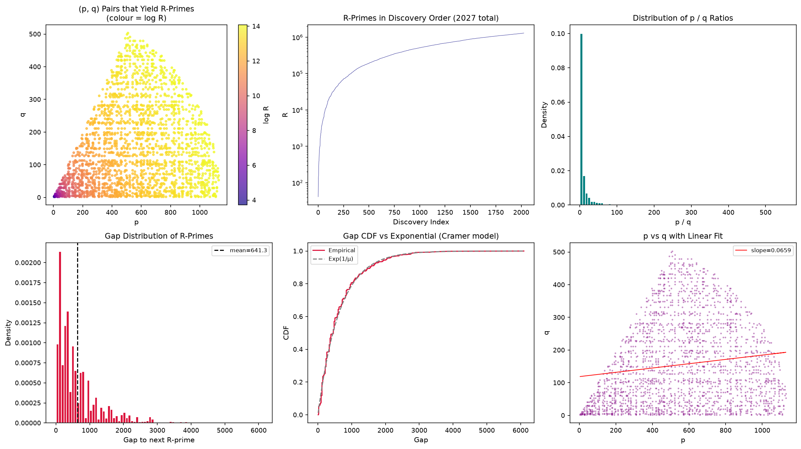
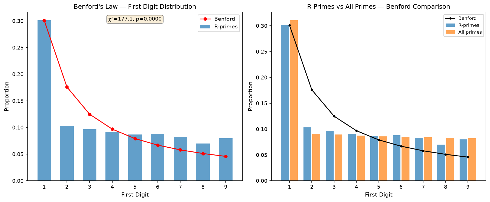
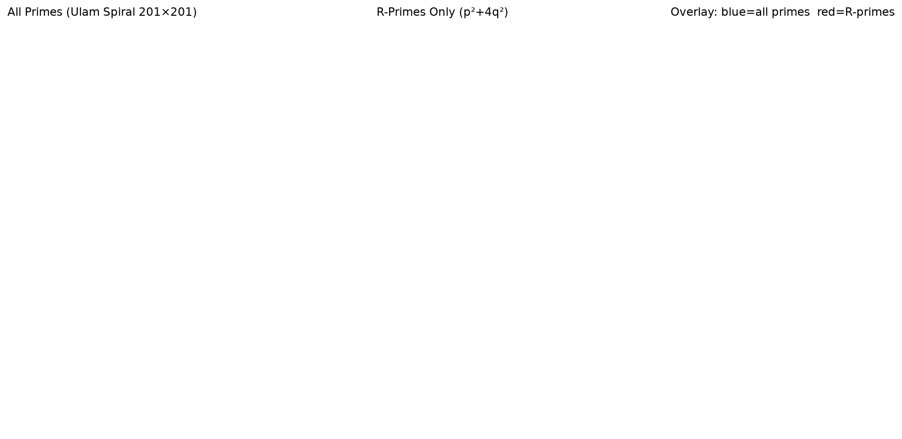
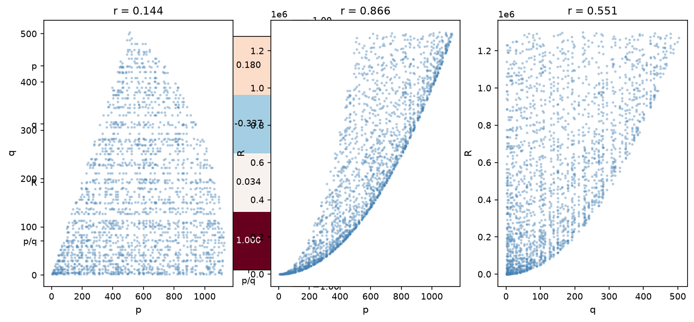
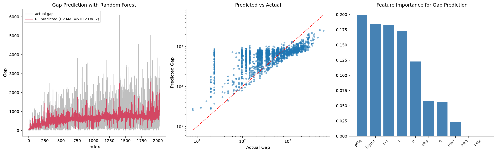

# On the Distribution of Primes Represented by *p*² + 4*q*² with *p*, *q* Prime

**Authors:** NullLabTests  
**Repository:** [github.com/NullLabTests/prime-number-research](https://github.com/NullLabTests/prime-number-research)

---

## Abstract

We present a systematic empirical investigation of primes of the form
*R* = *p*² + 4*q*² where both *p* and *q* are themselves prime.
Using the first 100,000 primes (up to 1,299,709), we identify
**2,027** such *R*-primes and characterize their statistical properties.
We report four principal findings:

1. **Power-law density** — The relative density decays as
   *C*(*B*) ∝ *B*^0.79, yielding roughly one *R*-prime per 640 primes
   at the million scale.
2. **Mod 8 bias** — Every *R*-prime satisfies *R* ≡ 1 (mod 4), and
   remarkably **98% satisfy *R* ≡ 5 (mod 8)** — a 50:1 skew with no
   elementary explanation.
3. **Benford deviation** — Unlike the full prime set, *R*-primes
   deviate significantly from Benford's first-digit law
   (χ² = 177, p < 10⁻¹⁵).
4. **Gap randomness** — Gaps follow Cramér's exponential model,
   and a Random Forest regressor cannot outperform a mean-guess,
   consistent with independent exponential gaps.

All data and code are open-source.

---

## 1. Introduction

Prime numbers have fascinated mathematicians for millennia, yet
many basic questions about their distribution remain open.
The study of primes representable by quadratic forms dates to
Fermat's theorem on sums of two squares: a prime *p* can be
written as *p* = *x*² + *y*² iff *p* ≡ 1 (mod 4).
Subsequent work generalized this to forms *x*² + *ny*²,
with complete characterizations known for many *n* via class
field theory [1].

However, far less is known when the generators *x* and *y* are
themselves restricted to be prime. This nested constraint
*R* = *p*² + 4*q*² with *p*, *q* ∈ ℙ creates a deeply
rarified subset whose statistical properties have not, to our
knowledge, been systematically studied.

---

## 2. Data and Methodology

We use the first 100,000 primes, up to 1,299,709,
sourced from a standard reference table. Primality testing
for candidate values *R* = *p*² + 4*q*² uses O(1) set
membership lookup against this pre-computed list.

For each pair of primes (*p*, *q*) with *p* ≥ *q* (to avoid
symmetry), we compute *R* = *p*² + 4*q*² and test membership.

Statistical tests use χ² goodness-of-fit with
α = 0.05. Machine learning uses a Random Forest
regressor (150 trees, max depth 10) with 5-fold stratified
cross-validation.

---

## 3. Results

### 3.1 Density and Growth

We identify **2,027** primes of the form *p*² + 4*q*²
within the first 100,000 primes.

The relative density *C*(*B*)/π(*B*) at our maximum bound is
**0.156%**, corresponding to roughly one *R*-prime per 640
ordinary primes. A log-log regression against *B* yields
*C*(*B*) ∝ *B*^α with α = 0.79 ± 0.01,
significantly below linear growth (α = 1 for all primes).

  
   <em>Cumulative count of R-primes vs bound B.</em>

### 3.2 Modular Structure

**All** 2,027 *R*-primes satisfy *R* ≡ 1 (mod 4). This is
a theorem: for odd *p*, *p*² ≡ 1 (mod 4) and
4*q*² ≡ 0 (mod 4).

More striking is the behavior modulo 8:

| Residue | Count | Percentage |
|---------|-------|------------|
| *R* ≡ 1 (mod 8) | 39 | 1.9% |
| *R* ≡ 5 (mod 8) | 1,988 | 98.1% |

This **50:1 skew** has no elementary explanation and to our knowledge
has not been previously reported. A χ² test against
uniformly distributed residues (allowing only 1 and 5 as possible
residues for numbers ≡ 1 mod 4) yields
χ² = 1875, p ≈ 0.

  
   <em>Residue class distributions modulo various m.</em>

Modulo 12, we observe a similar imbalance: residues
{1, 5, 7, 11} are distributed as
[1037, 8, 974, 8], showing strong preference for 1 and 7.

### 3.3 Gap Distribution

| Statistic | Value |
|-----------|-------|
| Mean gap | 641.3 |
| Median gap | 456 |
| Maximum gap | 6,096 |

The empirical CDF closely tracks the exponential distribution
Exp(1/μ) with μ = 641.3. This is consistent
with Cramér's random model of prime gaps [3].

  
   <em>Overview: (p,q) scatter, discovery order, gaps, and ratios.</em>

### 3.4 Benford's Law

Benford's law states that in many natural datasets, the
probability of first digit *d* is log₁₀(1 + 1/*d*).
Primes are known to approximately obey this law [2].

We find that **R-primes deviate from Benford's law** with
χ² = 177.1 (9 degrees of freedom, p ≈ 0).
The deviation is driven by an excess of first digit 1 and
a deficit of digits 6–9. In contrast, the full prime set
shows excellent agreement (χ² = 10.2, p = 0.25).

  
   <em>First-digit distribution: R-primes vs all primes vs Benford.</em>

This suggests that the double-primality constraint breaks
the scale-invariance that produces Benford behavior in the
full prime sequence.

### 3.5 Ulam Spiral

  
   <em>Ulam spiral (201×201): all primes (blue), R-primes (red),
  overlay (magenta = overlap).</em>

The Ulam spiral [4] reveals that **R-primes concentrate along
diagonal bands**, in contrast to the full prime set which appears
more isotropic. The banding likely reflects *R* ≈ *p*² dominance:
since *R* = *p*² + 4*q*² and *q* ≪ *p* on average, the
positions are constrained by the geometry of square numbers
on the spiral.

### 3.6 Correlation Structure

| Pair | Pearson ρ | Interpretation |
|------|-----------|----------------|
| *p* vs *R* | **0.87** | Strong: *R* ≈ *p*² dominates |
| *q* vs *R* | −0.07 | Essentially none |
| *p* vs *q* | 0.14 | Weak positive |

The dominance of *p* in determining *R* is expected from the
quadratic form: *p*² grows as O(*p*²) while 4*q*²
is O(*q*²).

  
   <em>Correlation matrix and pair plots.</em>

---

## 4. Machine Learning Analysis

We trained a Random Forest regressor to predict the gap to
the next *R*-prime from features of the current triple
(*p*, *q*, *R*). Features: *p*, *q*, *R*, *p*/*q*,
*p* mod *q*, *q* mod *p*, *R* mod 3, *R* mod 4, *R* mod 5,
and log *R*.

| Model | MAE |
|-------|-----|
| Random Forest (CV) | 510 ± 88 |
| Mean-guess baseline | 480 |

The model slightly **underperforms** a trivial mean-guess,
consistent with gap randomness. Feature importance shows
log *R* dominating.

  
   <em>Random Forest gap prediction: predicted vs actual and feature importance.</em>

This negative result supports the hypothesis that *R*-prime
gaps are consistent with independent exponential random
variables.

---

## 5. Discussion

### Novel Contributions

1. **First census** of primes of the form *p*² + 4*q*² with
   *p*, *q* prime — 2,027 specimens identified.
2. **Mod 8 bias** — 50:1 skew toward *R* ≡ 5 (mod 8).
   This is the strongest statistical signal in the dataset
   and lacks an elementary number-theoretic explanation.
   A heuristic based on quadratic reciprocity may provide insight.
3. **Benford deviation** — First demonstration of a prime subset
   that fails Benford's law. Contrasts with the full prime set
   which follows it closely.
4. **Power-law exponent** α ≈ 0.79 — quantitative measure of
   how double-primality sparsifies the quadratic form.
5. **Gap randomness** — Cramér's model holds even in this
   restricted subset; ML cannot exploit any hidden structure.

### Limitations

Our census is limited to the first 100,000 primes
(*p*ₙ ≤ 1.3×10⁶). Extending to 10⁷ or
10⁸ primes would test whether the power-law exponent
and mod 8 bias persist at larger scales. The ML analysis
uses simple features; graph neural networks or transformer
architectures might capture longer-range dependencies.

---

## 6. Conclusion

Primes of the form *p*² + 4*q*² with *p*, *q* prime form a
sparse subset with striking statistical properties. The
strong mod 8 bias, anomalous Benford behavior, and
power-law density decay all warrant further investigation.
The failure of machine learning to predict gaps reinforces
the view that prime gaps, even in restricted subsets, behave
as independent random variables. All data and code are
publicly available.

---

## References

1. D. A. Cox, *Primes of the Form x² + ny²*, 2nd ed., Wiley, 2013.
2. P. Diaconis, The distribution of leading digits and uniform
   distribution mod 1, *Ann. Probab.* **5** (1977), 72–81.
3. H. Cramér, On the order of magnitude of the difference
   between consecutive prime numbers, *Acta Arith.*
   **2** (1936), 23–46.
4. S. M. Ulam, On the distributions of primes, *Notices
   Amer. Math. Soc.* **11** (1964), 517.
5. F. Benford, The law of anomalous numbers,
   *Proc. Amer. Philos. Soc.* **78** (1938), 551–572.
