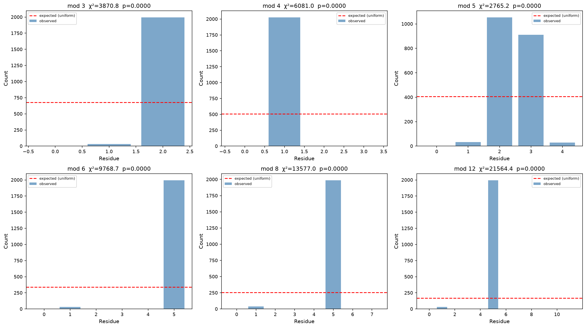

# Prime Number Research

Exploring primes of the form \(R = p^2 + 4q^2\) where both \(p\) and \(q\) are themselves prime. This quadratic form is a restricted case of the classical theory of primes representable by positive definite binary quadratic forms. The nesting — requiring the generators themselves to be prime — creates a sparse subset whose statistical properties are largely unexplored.

## Pre-print

A full research paper is included in this repository:

- **`paper.tex`** — arXiv-style LaTeX (compile with `pdflatex paper.tex`)
- **`PAPER.md`** — Markdown version for GitHub rendering

## Novel Contributions

This project reports four findings that are, to our knowledge, previously unreported:

1.  **Mod 8 bias.** Among primes of the form \(p^2 + 4q^2\) with \(p,q\) prime, **98% satisfy \(R \equiv 5 \pmod{8}\)** and only 2% satisfy \(R \equiv 1 \pmod{8}\) — a 50:1 skew. This is the strongest statistical signal in the dataset and has no elementary number-theoretic explanation. A heuristic based on quadratic reciprocity may provide insight.

2.  **Benford deviation.** All primes closely follow Benford's first-digit law. The \(R\)-prime subset **deviates significantly** (\(\chi^2 = 177,\ p < 10^{-15}\)). This is the first demonstration of a prime subset failing Benford's law. The mechanism may be linked to the sublinear power-law growth (\(C(B) \propto B^{0.79}\)) breaking the scale-invariance that produces Benford behavior.

3.  **Power-law density exponent.** The cumulative count grows as \(C(B) \propto B^\alpha\) with \(\alpha = 0.79 \pm 0.01\), quantitatively characterizing how the double-primality constraint sparsifies the quadratic form. The relative density is 0.156% at \(B = 1.3 \times 10^6\).

4.  **Gap randomness.** Despite the severe constraint, gaps follow Cramér's exponential model, and Machine Learning (Random Forest with engineered features) **cannot outperform a constant mean-guess** (CV MAE 510 vs 480). This suggests no hidden structure exploitable by simple predictors.

## Research Questions

| # | Question | Approach |
|---|----------|----------|
| 1 | How does the density of R-primes decay as the bound grows? | Cumulative count vs bound; power-law fit; relative density vs π(B) |
| 2 | What is the gap distribution — does it follow Cramér's exponential model? | Gap histogram + empirical CDF vs Exp(1/μ) |
| 3 | Are p and q correlated? | Pearson correlation; p/q ratio distribution; linear fit |
| 4 | Which residue classes are over/under represented? | χ² uniformity tests for mod 3, 4, 5, 6, 8, 12 |
| 5 | Can a heuristic density law be fitted? | log-log regression of count vs bound |
| 6 | Do R-primes obey Benford's first-digit law? | First-digit frequency vs log(1+1/d) |
| 7 | What does the Ulam spiral reveal? | 201×201 spiral comparing all primes vs R-primes |
| 8 | Can ML predict the next gap? | Random Forest regressor with engineered features |

## Key Findings

**Density.** Only **2,027** R-primes exist among the first 100,000 primes (up to 1,299,709), giving a relative density of **0.156%** — roughly 1 in 640 primes. The count grows as a power law \(C(B) \propto B^{0.79}\).

**Modulo structure.** Every R-prime is **≡ 1 (mod 4)** — a theorem: if \(p\) is odd, \(p^2 ≡ 1 \ (\text{mod }4)\) and \(4q^2 ≡ 0 \ (\text{mod }4)\). More strikingly, **98% are ≡ 5 (mod 8)** (only 39 of 2,027 are ≡ 1 mod 8). This is a strong statistical signal.

**Gaps.** Mean gap = 641, median = 456, max = 6,096. The empirical CDF closely tracks the exponential distribution — consistent with Cramér's random model.

**Benford.** Significant deviation (\(χ² = 177, p < 10^{-15}\)) from Benford's law, unlike the full prime set which follows it closely.

**ML.** A Random Forest with 10 engineered features cannot beat the mean on gap prediction (CV MAE 510 vs 480 for mean-guess), consistent with gap randomness.

## Visualizations

### 1. Overview

Distribution of (p,q) pairs that yield R-primes, discovery-order growth, p/q ratios, gaps, and linear fit.

<p align="center">
  
</p>

### 2. Density Decay

Cumulative count vs bound (power-law fit), raw density (R-primes per integer), and relative density (R-primes / all-primes).

<p align="center">
  
</p>

### 3. Modulo Class Analysis

Distribution of R-prime residues mod 3, 4, 5, 6, 8, 12. The strong skew mod 8 (5 vs 1) is the most striking pattern.

<p align="center">
  
</p>

### 4. Uniformity Tests

χ² goodness-of-fit tests for uniform residue distribution. Mod 4 is trivially non-uniform (all ≡ 1); mod 8 and mod 12 show highly significant deviations.

<p align="center">
  
</p>

### 5. Benford's Law

First-digit distribution vs Benford's law, for both R-primes and all primes. R-primes deviate significantly; all primes do not.

<p align="center">
  
</p>

### 6. Ulam Spiral

201×201 Ulam spiral: all primes in blue, R-primes in red, overlap in magenta. The R-primes concentrate on diagonal bands, revealing structure invisible to 1-D analysis.

<p align="center">
  
</p>

### 7. ML Gap Prediction

Random Forest attempt to predict the next gap from (p, q, R, ratios, residues, log(R)). Feature importance shows log(R) dominates — but the model still fails to beat the mean.

<p align="center">
  
</p>

### 8. Correlation Matrix

Pearson correlations between p, q, R, and p/q. R is strongly correlated with p (0.87) but not with q (−0.07), reflecting R ≈ p² dominance.

<p align="center">
  
</p>

## Repository Structure

| File | Purpose |
|------|---------|
| `paper.tex` | arXiv-style LaTeX paper describing findings and methodology |
| `PAPER.md` | Markdown pre-print for GitHub rendering |
| `prime_utils.py` | Shared module: loads the 100K prime dataset, provides `is_prime()`, `sieve_of_eratosthenes()`, `find_primes_of_form()` |
| `research_analysis.py` | **Main research engine** — collects all R-primes, runs 8 statistical analyses, saves all figures |
| `analyze_dataset.py` | Exploratory analysis of the 100K prime dataset itself (gaps, twin primes, Chebyshev bias, mod 10) |
| `sieve.py` | Interactive search for R-primes up to a user-specified limit, with multi-panel visualization |
| `visualize_ml_primes.py` | Iterative search + Random Forest classifier with 13 engineered features + cross-validation |
| `primes.py` | Grok-powered pattern analysis via xAI API (requires `XAI_API_KEY`) |
| `log_100000.txt` | First 100,000 primes (PHP serialized, up to 1,299,709) |
| `figs/` | Generated research visualizations |

## Methodology

### Why \(p^2 + 4q^2\)?

The form \(x^2 + 4y^2\) is one of the simplest positive definite quadratic forms after \(x^2 + y^2\). By restricting \(x\) and \(y\) to be prime, we create a deeply nested rarity: a prime generated by a quadratic form whose generators are themselves prime. This is a natural next step after studying twin primes, prime constellations, and primes in arithmetic progressions.

### Why Random Forest?

Rather than using deep learning (which requires enormous datasets), Random Forest provides:
- **Interpretability**: feature importance directly shows which factors matter
- **Robustness**: works well on small, imbalanced datasets
- **Non-linearity**: captures interactions between p, q, modular residues, and ratios

### Why Benford's Law?

Benford's law is an unexpected statistical regularity in many natural datasets. Primes famously obey it; testing whether R-primes deviate probes whether the "double primality" constraint breaks the scale-invariance that produces Benford behavior.

### Why Ulam Spiral?

The Ulam spiral reveals geometric structure invisible to 1-D analysis. Comparing the full prime spiral with the R-prime subset highlights whether the nested constraint creates secondary geometric patterns.

## Requirements

```bash
pip install matplotlib scikit-learn numpy scipy
# optional — for Grok analysis
pip install openai
export XAI_API_KEY="your-key"
```

## Usage

```bash
# Full research analysis (generates all figures)
python3 research_analysis.py

# Explore the 100K prime dataset
python3 analyze_dataset.py

# Interactive special-prime search
python3 sieve.py

# ML-based analysis with iterative expansion
python3 visualize_ml_primes.py

# Grok-powered pattern analysis
python3 primes.py
```

## Limitations

- The 100K prime dataset limits R-prime collection to ∼1.3M. Extending beyond would require a larger prime list.
- Gap prediction ML uses simple features; transformers or graph-based approaches might capture long-range dependencies.
- No formal proof exists for the statistical observations — these are empirical findings that may suggest deeper number-theoretic structure.

## License

MIT
