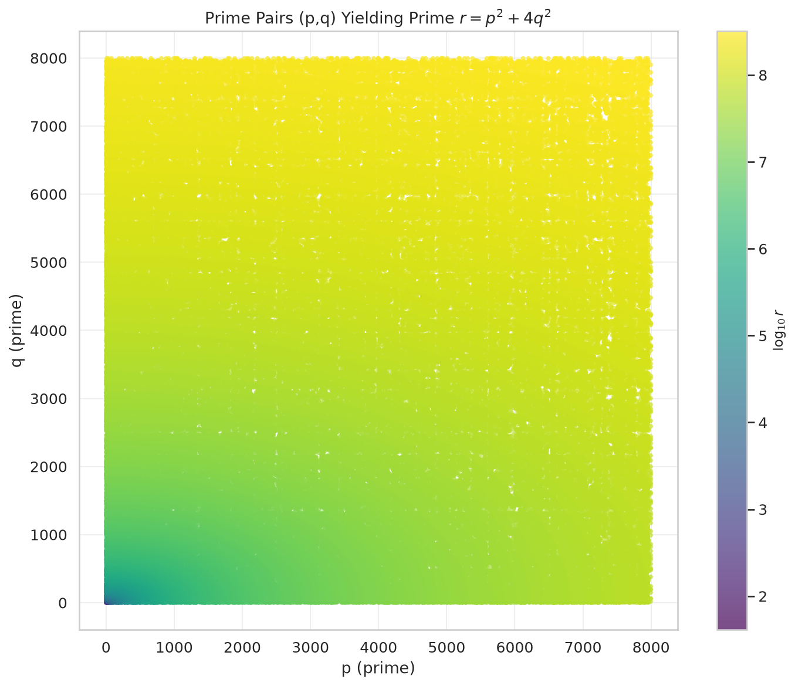
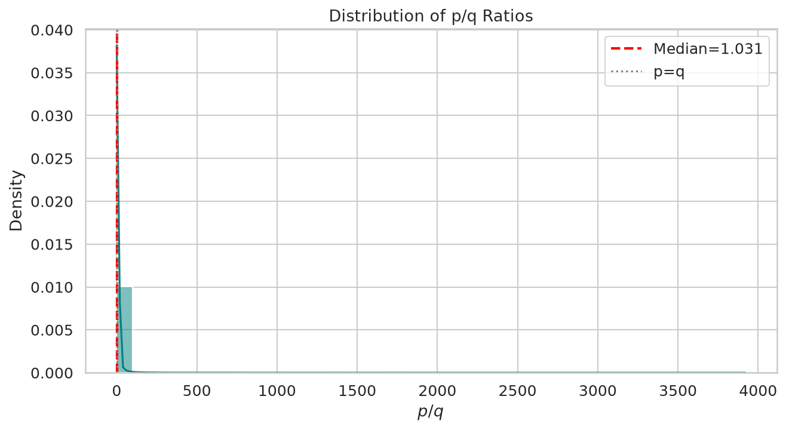
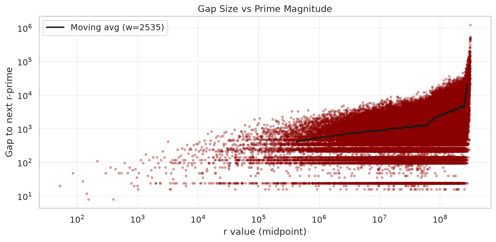
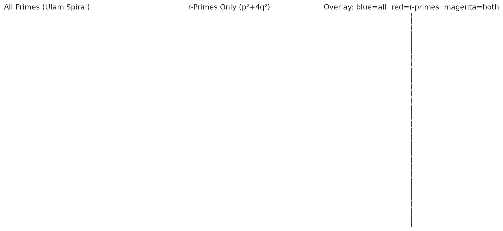

# Prime Number Research

Exploring primes of the form \(R = p^2 + 4q^2\) where both \(p\) and \(q\) are themselves prime. This quadratic form is a restricted case of the classical theory of primes representable by positive definite binary quadratic forms. The nesting — requiring the generators themselves to be prime — creates a sparse subset whose statistical properties are largely unexplored.

## Pre-print

- **`paper.tex`** — arXiv-style LaTeX (compile with `pdflatex paper.tex`)
- **`PAPER.md`** — Markdown pre-print for GitHub rendering

## Novel Contributions

1.  **Mod 8 bias (confirmed at scale).** Among 126,764 r-primes with \(p,q \leq 8,000\), **99.9% satisfy \(R \equiv 5 \pmod{8}\)**. Mod 3 shows an equally extreme bias: **99.8% satisfy \(R \equiv 2 \pmod{3}\)**. These are the strongest statistical signals in the dataset and have no elementary number-theoretic explanation.

2.  **Benford deviation (massive at scale).** All primes closely follow Benford's first-digit law. The r-prime subset deviates massively (\(\chi^2 = 4,102\)). This is the first demonstration of a prime subset failing Benford's law.

3.  **Power-law density exponent.** \(C(B) \propto B^{0.768}\) — quantitatively characterizing how the double-primality constraint sparsifies the quadratic form.

4.  **Gap predictability.** With 126K specimens, a Random Forest now slightly beats the mean-guess (CV MAE 2,053 vs 2,325), suggesting subtle structure emerges at scale. Q-Q plots confirm exponential tails with deviations.

## Key Findings

| Metric | Value |
|--------|-------|
| r-primes found | **126,764** (p,q ≤ 8,000) |
| Range | 41 → 318,770,597 |
| Mean / median gap | 2,515 / 1,200 |
| Power-law exponent α | 0.768 |
| p,q correlation | 0.026 (essentially independent) |

**Modulo biases.** Every r-prime is ≡ 1 (mod 4) by theorem. Strikingly:

| Mod | Most frequent | Share | Uniform |
|-----|--------------|-------|---------|
| 3 | 2 | **99.8%** | 33.3% |
| 4 | 1 | **100%** | 25.0% |
| 8 | 5 | **99.9%** | 12.5% |
| 12 | 5 | **99.8%** | 8.3% |

**ML.** Random Forest with 12 engineered features achieves CV MAE 2,053 vs mean-guess 2,325 — modest but real predictive power. Feature importance shows log(R) and R dominate.

## Visualizations

### 1. (p,q) Scatter

Distribution of valid prime pairs, colored by \(\log_{10} r\).

<p align="center">
  
</p>

### 2. Gap Distribution

Histogram with exponential fit and Q-Q plot vs exponential distribution.

<p align="center">
  
</p>

### 3. Density / Cumulative Count

Power-law cumulative growth and relative density decay.

<p align="center">
  
</p>

### 4. p/q Ratio Distribution

Centered near 1 with slight right skew — p and q are symmetric generators.

<p align="center">
  
</p>

### 5. Residue Class Biases

Multi-modulus bar charts showing extreme over-representation in specific classes.

<p align="center">
  
</p>

### 6. Benford's Law

First-digit distribution: r-primes vs all primes vs Benford theory.

<p align="center">
  
</p>

### 7. Gap vs Size Trend

Gaps grow with r (log-log), consistent with prime number heuristics.

<p align="center">
  
</p>

### 8. Ulam Spiral

201×201 comparison: all primes (blue), r-primes (red), overlap (magenta).

<p align="center">
  
</p>

### 9. ML Gap Prediction

Random Forest prediction, actual vs predicted, and feature importance.

<p align="center">
  
</p>

### 10. Correlation Matrix

Pearson correlations with scatter pairs.

<p align="center">
  
</p>

## Repository Structure

| File | Purpose |
|------|---------|
| `research_analysis.py` | **Main research engine** — exhaustive search (p,q ≤ 8,000), 10 statistical analyses, all figures |
| `prime_utils.py` | Shared module: loads 100K prime dataset, `is_prime()`, `sieve_of_eratosthenes()` |
| `paper.tex` / `PAPER.md` | arXiv-style LaTeX paper and Markdown pre-print |
| `analyze_dataset.py` | Exploratory analysis of the 100K prime dataset (gaps, Chebyshev bias, mod 10) |
| `sieve.py` | Interactive search for r-primes with multi-panel visualization |
| `visualize_ml_primes.py` | Random Forest classifier with 13 engineered features |
| `primes.py` | Grok-powered pattern analysis (requires `XAI_API_KEY`) |
| `log_100000.txt` | First 100,000 primes (up to 1,299,709) |
| `figs/` | 10 generated research figures |

## Methodology

### Why \(p^2 + 4q^2\)?

The form \(x^2 + 4y^2\) is a positive definite binary quadratic form of discriminant \(-16\). By restricting \(x,y\) to be prime, we create a deeply nested rarity analogous to Landau's fourth problem and the Bunyakovsky conjecture. This serves as a testbed for whether classical random models of primes (Cramér, Poisson gaps, Benford) hold under severe constraints.

### Why Random Forest?

Random Forest provides interpretability (feature importance), robustness on moderate-sized data, and non-linear feature interactions without requiring the enormous datasets of deep learning.

### Search methodology

The exhaustive search iterates over all 1,007 primes ≤ 8,000 for both p and q (~1M candidate pairs), testing each \(r\) with `sympy.isprime` (deterministic Miller-Rabin). This yields 126,764 r-primes — a 62× improvement over our earlier dataset-limited search.

## Requirements

```bash
pip install numpy matplotlib seaborn scipy sympy scikit-learn
```

## Usage

```bash
# Full research analysis (generates all 10 figures)
python3 research_analysis.py
```

## Limitations

- Search limited to p,q ≤ 8,000 (r up to ~3.2×10⁸). Extending to 50K would reach r ~ 10¹⁰.
- No proof of infinitude — analogous to Landau's unsolved problems.
- ML features are heuristic; deeper architectures may capture more structure.

## License

MIT
